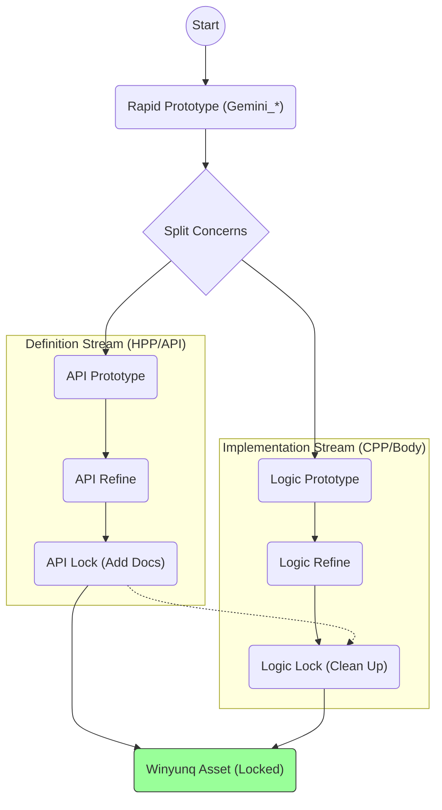
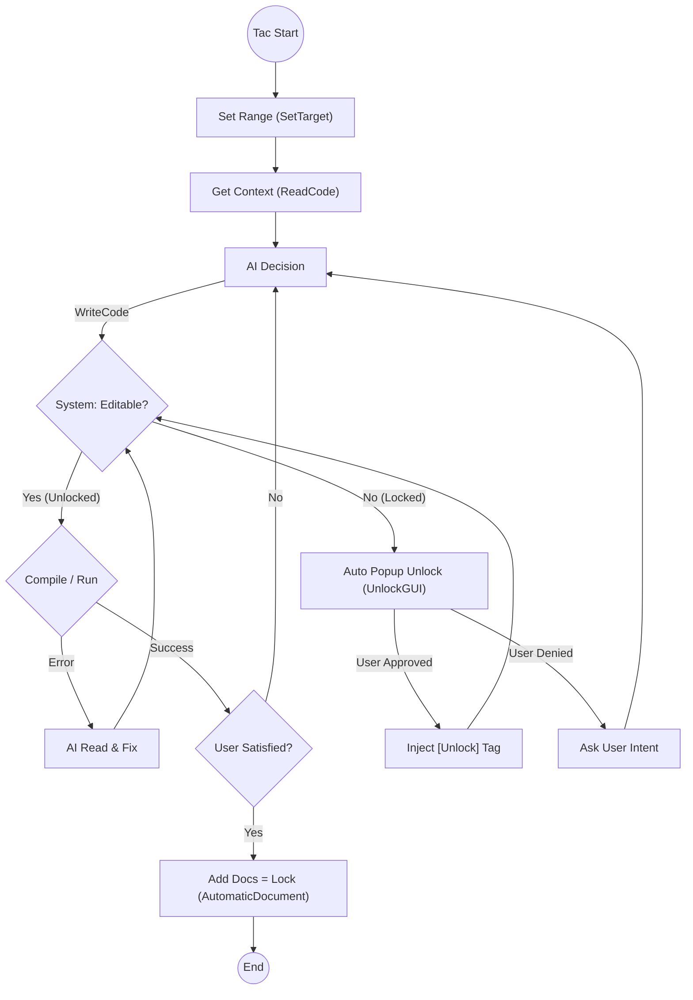

# Winyunq CodeStyle & Collaboration Protocol

> **"Strategy by Humans, Tactics by AI."**

## The Winyunq Philosophy

> **Winyunq Concept**:
> People pursue efficiency to optimize problems. However, true efficiency gains stem from greater investment and should be applied to achieve even greater results. We cannot improve efficiency by merely saving input, nor can we apply efficiency gains to save input. This is the core philosophy of Winyunq.
>
> Therefore, in coding, using AI merely to "save effort" will eventually lead to uncontrolled code.  **AI assistance should enable humans to produce higher quality code with the same amount of energy.** This Skill System assists users in achieving better code quality under the same effort.

---

> **Note on Language:**
> I've heard that Chinese has the highest information entropy, and as a native speaker, I use Chinese for comments and documentation to maximize expression efficiency. You are welcome to ask AI to fork this repository and create a branch for your language. We may consider adding "Comment Language Switching" features in the future.

---

## 1. Macro Lifecycle Workflow

Code evolution is split into two parallel streams: **Definition (API)** and **Implementation (Body)**. They evolve through Prototyping, Refining, and Locking stages separately, often with a time offset.

- **Parallel Evolution**: Interface definitions (`.hpp`) usually stabilize before implementation details (`.cpp`).
- **Time Offset**: API Locking typically precedes Implementation Locking.
- **Archiving**: Both streams eventually converge into a fully locked asset.

---

## 2. Tactical Execution Loop

The AI does not actively check for locks. It attempts to edit, and the **System** decides whether to proceed or trigger a passive unlock flow.

### Key Logic
1.  **Direct Action**: AI uses `ReadCode` to understand context and then immediately calls `WriteCode` (Overwrite/Block/Insert). It does not "check permission" first.
2.  **System Guard (Passive Check)**:
    *   **Unlocked**: No formal docs or `Gemini` prefix -> **Pass**.
    *   **Locked**: Full docs present & No Unlock tag -> **Block** & Trigger Unlock.
3.  **Passive Unlock**: Triggered automatically when AI touches a locked asset. User approves batch unlock via `UnlockGUI`.
4.  **Locking = Documenting**: When the user is satisfied, AI adds documentation (`AutomaticDocument`). The system's locking rules automatically recognize this as **Locked**.

---

## 3. Toolchain Matrix

| Tool           | Phase     | Core Function                                                    |
| :------------- | :-------- | :--------------------------------------------------------------- |
| **SetTarget**  | Prep      | Initialize context, auto-create `Gemini_` drafts.                |
| **ReadCode**   | Recon     | `List` (Outline), `Read` (Implementation).                       |
| **WriteCode**  | Action    | **Sole writing entry**. Supports `Overwrite`, `Block`, `Insert`. |
| **UnlockGUI**  | Privilege | Passive trigger when editing locked code. Popup request.         |
| **CheckStyle** | Audit     | Status check (`Check`) and Promotion (`Promote`).                |

## 4. "Gemini" Sandbox
To ensure stability during large edits:
1. Agent writes code to a temp file (e.g., `Gemini_Temp.py`).
2. Calls `WriteCode Define target.py Gemini_Temp.py`.
3. Script applies changes and automatically **shreds (deletes)** the temp file.
