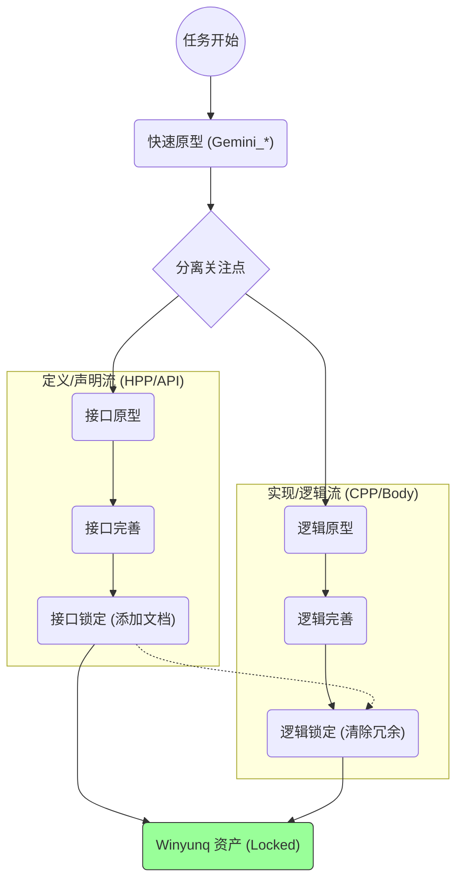
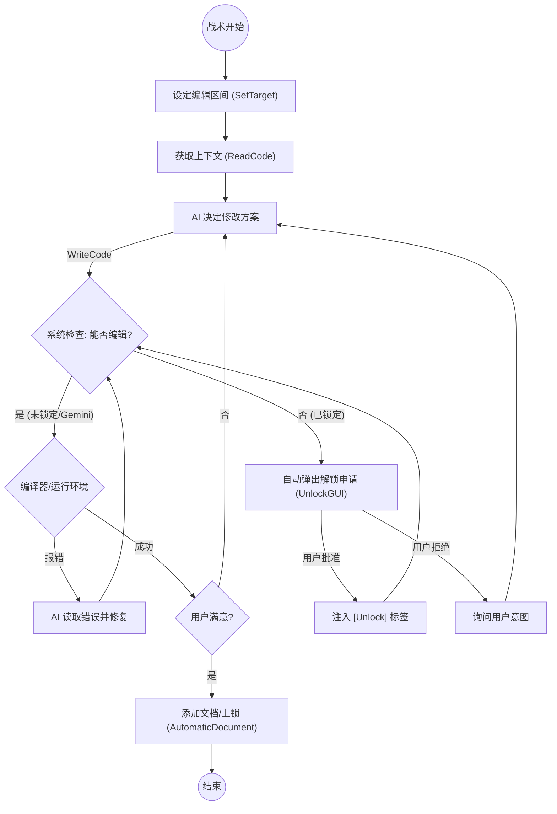

# Winyunq CodeStyle 与 协作协议

> **"战略由人，战术由AI。"**

## Winyunq 理念

> **Winyunq 概念**：
> 人们追求效率，为了效率优化各种问题。然而，效率的提升，只来源于更大的投入，也只会用于更大的投入。我们无法通过节省投入的方法提升效率，我们也无法将效率提升应用在节省投入上，这是 winyunq 的理念。
>
> 因此，在写代码这件事上，单纯使用 AI 节约我们的投入只会让代码最终走向不可控。至少我认为，**AI 辅助人写代码应该是让人在相同精力下，代码的质量更好。** 因此这套 Skill 的作用是协助用户在相同精力下写出更好的代码。

---

## 1. 全生命周期工作流 (Macro Lifecycle)

代码的演进分为 **定义 (声明/API)** 与 **实现 (逻辑/Body)** 两个并行分支。它们各自经历原型、完善、归档三个阶段，但在时间轴上存在依赖偏移。

- **并行演进**: 接口定义 (`.hpp`) 往往先于实现细节 (`.cpp`) 稳定。
- **时间差**: 虽然都在完善，但 API 锁定通常早于实现锁定。
- **归档**: 两个流最终汇聚为被完全锁定保护的资产。

---

## 2. 战术执行循环 (Tactical Loop)

AI 不再主动检查锁定状态，而是直接尝试执行编辑。系统根据锁定状态决定是否放行或触发解锁流程（被动解锁）。

### 关键逻辑
1.  **AI 直接行动**: AI 通过 `ReadCode` 了解上下文后，直接使用 `WriteCode` 进行“覆写”、“块编辑”或“插入”。AI 不需要预先去“检查锁”。
2.  **系统守护 (Passive Check)**:
    *   **未锁定**: 代码没有正式文档或带有 `Gemini` 前缀。-> **直接放行**。
    *   **已锁定**: 代码包含完整文档且无 Unlock 标签。-> **拦截** 并触发解锁流程。
3.  **被动解锁 (Passive Unlock)**: 并非 AI 主动想去解锁，而是因为 AI 触碰了锁定资产，系统自动弹出 `UnlockGUI` 批量申请权限。
4.  **上锁即交付**: 当用户对功能满意时，AI 添加文档 (`AutomaticDocument`)。系统的锁定规则检测到文档存在，自动将其视为 **Locked**，无需额外操作。

---

## 3. 自动化工具链 (Toolchain Matrix)

| 工具           | 对应阶段 | 核心功能                                                                       |
| :------------- | :------- | :----------------------------------------------------------------------------- |
| **SetTarget**  | 准备     | 初始化上下文，自动创建 `Gemini_` 草稿文件。                                    |
| **ReadCode**   | 侦察     | `List` (列出大纲), `Read` (读取实现)。                                         |
| **WriteCode**  | 战斗     | **唯一写入入口**。支持 `Overwrite` (覆盖), `Block` (块覆写), `Insert` (插入)。 |
| **UnlockGUI**  | 特权     | 当尝试编辑锁定代码时被动触发，弹窗申请修改权。                                 |
| **CheckStyle** | 验收     | 状态审计 (`Check`) 与 晋升 (`Promote`)。                                       |

## 4. "Gemini" 沙箱机制
为确保大规模代码写入的稳定性：
1. Agent 将代码写入临时文件 (如 `Gemini_Temp.py`)。
2. 调用 `WriteCode Define target.py Gemini_Temp.py`。
3. 脚本应用修改，并自动 **粉碎 (删除)** 临时文件。
