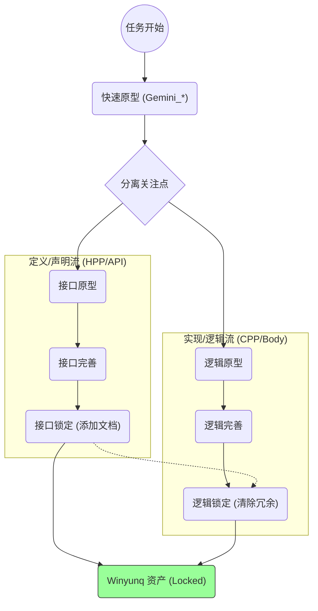
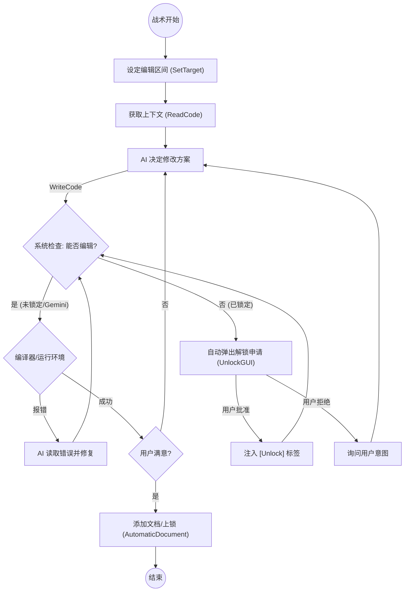

# Winyunq CodeStyle 与 协作协议


> **"战略由人，战术由AI。"**

## Winyunq 理念

> **Winyunq 概念**：
> 人们追求效率，为了效率优化各种问题。然而，效率的提升，只来源于更大的投入，也只会用于更大的投入。我们无法通过节省投入的方法提升效率，我们也无法将效率提升应用在节省投入上，这是 winyunq 的理念。
>
> 因此，在写代码这件事上，单纯使用 AI 节约我们的投入只会让代码最终走向不可控。至少我认为，**AI 辅助人写代码应该是让人在相同精力下，代码的质量更好。** 因此这套 Skill 的作用是协助用户在相同精力下写出更好的代码。

---

## 1. 全生命周期工作流 (Macro Lifecycle)

代码的演进分为 **定义 (声明/API)** 与 **实现 (逻辑/Body)** 两个并行分支。它们各自经历原型、完善、归档三个阶段，但在时间轴上存在依赖偏移。


```mermaid
graph TD
    Start(("任务开始")) --> Draft("快速原型 (Gemini_*)")
    Draft --> Split{"分离关注点"}

    %% 分支 1: 定义流 (Definition Stream)
    subgraph DefStream ["定义/声明流 (HPP/API)"]
        direction TB
        Def_Proto("接口原型")
        Def_Refine("接口完善")
        Def_Lock("接口锁定 (添加文档)")
        
        Def_Proto --> Def_Refine --> Def_Lock
    end

    %% 分支 2: 实现流 (Implementation Stream)
    subgraph ImplStream ["实现/逻辑流 (CPP/Body)"]
        direction TB
        Impl_Proto("逻辑原型")
        Impl_Refine("逻辑完善")
        Impl_Lock("逻辑锁定 (清除冗余)")
        
        Impl_Proto --> Impl_Refine --> Impl_Lock
    end

    Split --> Def_Proto
    Split --> Impl_Proto

    %% 阶段依赖
    Def_Lock -.-> Impl_Lock

    Def_Lock --> Final("Winyunq 资产 (Locked)")
    Impl_Lock --> Final
    
    style Final fill:#9f9,stroke:#333
```

- **并行演进**: 接口定义 (`.hpp`) 往往先于实现细节 (`.cpp`) 稳定。
- **时间差**: 虽然都在完善，但 API 锁定通常早于实现锁定。
- **归档**: 两个流最终汇聚为被完全锁定保护的资产。

---

## 2. 战术执行循环 (Tactical Loop)

AI 不再主动检查锁定状态，而是直接尝试执行编辑。系统根据锁定状态决定是否放行或触发解锁流程（被动解锁）。


```mermaid
graph TD
    Start(("战术开始")) --> SetTarget["设定编辑区间 (SetTarget)"]
    SetTarget --> GetContext["获取上下文 (ReadCode)"]
    GetContext --> AIDecide["AI 决定修改方案"]
    
    AIDecide -- "WriteCode" --> SystemCheck{"系统检查: 能否编辑?"}
    
    %% 情况 1: 可编辑 (未锁定/Draft)
    SystemCheck -- "是 (未锁定/Gemini)" --> Compiler{"编译器/运行环境"}
    
    Compiler -- "报错" --> Fix["AI 读取错误并修复"]
    Fix --> SystemCheck
    
    Compiler -- "成功" --> UserReview{"用户满意?"}
    UserReview -- "否" --> AIDecide
    UserReview -- "是" --> AddDoc["添加文档/上锁 (AutomaticDocument)"]
    AddDoc --> End(("结束"))

    %% 情况 2: 不可编辑 (已锁定) -> 被动触发解锁
    SystemCheck -- "否 (已锁定)" --> PassiveUnlock["自动弹出解锁申请 (UnlockGUI)"]
    
    PassiveUnlock -- "用户批准" --> InjectTag["注入 [Unlock] 标签"]
    InjectTag --> SystemCheck
    
    PassiveUnlock -- "用户拒绝" --> AskUser["询问用户意图"]
    AskUser --> AIDecide
```

### 关键逻辑
1.  **AI 直接行动**: AI 通过 `ReadCode` 了解上下文后，直接使用 `WriteCode` 进行“覆写”、“块编辑”或“插入”。AI 不需要预先去“检查锁”。
2.  **系统守护 (Passive Check)**:
    *   **未锁定**: 代码没有正式文档或带有 `Gemini` 前缀。-> **直接放行**。
    *   **已锁定**: 代码包含完整文档且无 Unlock 标签。-> **拦截** 并触发解锁流程。
3.  **被动解锁 (Passive Unlock)**: 并非 AI 主动想去解锁，而是因为 AI 触碰了锁定资产，系统自动弹出 `UnlockGUI` 批量申请权限。
4.  **上锁即交付**: 当用户对功能满意时，AI 添加文档。系统的锁定规则检测到文档存在，自动将其视为 **Locked**，无需额外操作。

---

## 3. 工具集详解 (Toolset Reference)

### 3.1 核心概念：代码对象分类 (Taxonomy)

为了简化 AI 的认知模型，我们将所有代码对象归纳为三类，`ReadCode -> List` 的行为也仅基于此分类：

| 类别 (Category)         | 包含对象 (Objects)                       | `List` 行为 (Autocomplete Semantics)              |
| :---------------------- | :--------------------------------------- | :------------------------------------------------ |
| **Container (容器)**    | `Namespace`, `Class`, `Struct`, `Module` | **展开成员 (Expand)**。<br>返回子对象的名称列表。 |
| **Executable (执行体)** | `Function`, `Method`, `Constructor`      | **查询调用 (Signature)**。<br>返回参数名称列表。  |
| **Data (数据)**         | `Variable`, `Field`, `Property`          | **查询类型 (Type)**。<br>返回数据类型名称。       |

### 3.2 ReadCode (侦察 / Context Reader)
**功能**: 基于分类学 (Taxonomy) 的去路径化读取，支持“深度穿透”。
**功能**: 读取上下文，支持四级信息层级，原则上返回 **JSON** 格式。

| Action          | Functionality            | Behavior (Output Format: JSON)                                                                                                                                                           |
| :-------------- | :----------------------- | :--------------------------------------------------------------------------------------------------------------------------------------------------------------------------------------- |
| **List**        | 快速扫描 (Autocomplete)  | **最常用/最精简**。返回 `["Name1", "Name2"]`。<br>- **Namespace/File**: 列出类名/函数名。<br>- **Class**: 列出成员名。<br>- **Function**: 列出参数名。<br>- **Variable**: 列出变量类型。 |
| **Declaration** | 紧凑接口 (Interface)     | 对函数 Target 只返回头文件声明与紧邻公开注释；不返回所在头文件的其他成员。                                                                                                             |
| **Definition**  | 紧凑实现 (Body)          | 对函数 Target 只返回该函数的实现代码，自动剥离注释和兄弟函数。                                                                                                                         |
| **Reference**   | 读取引用 (Usage)         | 返回 **JSON List** `[{ "file": "...", "line": 10, "scope": "..." }]`。<br>列出所有引用位置上下文。                                                                                       |
| **Comments**    | 独立注释读取              | 缺省只返回函数体内部注释；可选择 `declaration`、`definition` 或 `all`。                                                                                                                 |
| **ReadForEdit** | 精确维护读取              | 只返回当前 Target 的原始源码并保留其注释，不读取完整文件。                                                                                                                             |

### 3.2.1 上下文压缩调用

```text
SetTarget_Target("ABuildingGridVisualizer::UpdateGrid")
ReadCode_Declaration({})
ReadCode_Definition({})
ReadCode_Comments({ "part": "body" })
ReadCode_ReadForEdit({})
```

上述调用分别读取公开接口、无注释实现、函数体注释和精确编辑源码。除非进入下一层维护，不应把完整 `.h` 或 `.cpp` 文件送入 AI 上下文。Doxygen 可用于探测声明与函数体范围，但不是必需依赖；缺少 Doxygen 时由内置词法切片器完成同样的 Target 级读取。

### 3.2.2 Target 级编辑事务

```text
EditCode_Prepare({})
EditCode_Preview({ "old_code": "Value = OldValue;", "new_code": "Value = NewValue;" })
EditCode_Replace({ "old_code": "Value = OldValue;", "new_code": "Value = NewValue;" })
```

Target 已经包含函数身份，因此 `Prepare` 只返回当前函数的无注释函数体，并由 MCP 在内部记住源码版本。`Replace` 只接收短小的纯代码片段，只在当前函数体内解析和原子替换。文件版本过期、匹配不唯一、新代码夹带注释或替换范围穿过既有注释时一律拒绝。函数签名、已有注释和兄弟函数由程序保留，AI 不需要为了排版或防止丢失而复述它们。

### 3.2.3 用户显式锁定

```text
TargetLock_Lock({ "reason": "用户确认该行为已经稳定" })
TargetLock_Status({})
TargetLock_Unlock({ "confirmation": "UNLOCK ABuildingGridVisualizer::UpdateGrid" })
```

锁属于逻辑 Target，而不是整个文件。锁定函数仍可读取和无副作用预览，但 `EditCode_Replace` 必须拒绝任何写入。解锁是独立的用户授权操作：AI 不得把普通的“修改这个函数”推断成“允许解锁”。锁定和解锁都会使旧编辑票据失效，因此解锁后必须重新 `Prepare` 才能写入。


### 3.3 WriteCode (战斗 / Editor)
**功能**: 唯一写入入口，确保文件完整性与版本控制。

| Action      | Functionality         | Behavior                                                   |
| :---------- | :-------------------- | :--------------------------------------------------------- |
| **Define**  | 写入/覆盖 (Overwrite) | 接收完整文件路径或内容，进行覆盖或新建。会自动创建父目录。 |
| **Declare** | 声明/追加 (Append)    | 向文件追加内容 (通常用于 HPP 追加声明)。                   |
| **Block**   | 块编辑 (Block Edit)   | (Advanced) 针对特定代码块进行精细替换。                    |
| **Target**  | 设定目标 (Set Target) | (Legacy) 快捷设定当前操作文件。                            |

### 3.4 SetTarget (战略 / Setup)
**功能**: 初始化战略上下文 (Working Path & Filters)。

| Action     | Functionality | Behavior                                                  |
| :--------- | :------------ | :-------------------------------------------------------- |
| **Status** | 查看状态      | 一键审计当前的 `work_path`、`filters` 等战略状态。        |
| **Path**   | 修改路径      | 重新锚定 AI 的战略聚焦区域（逻辑根目录）。                |
| **Filter** | 过滤规则      | 设定排除规则（如 `bin;node_modules`）以压缩 AI 认知负荷。 |

### 3.5 CheckCode (审计 / Auditor)
**功能**: 代码风格与合规性检查。

| Action    | Functionality | Behavior                                              |
| :-------- | :------------ | :---------------------------------------------------- |
| **Style** | 风格检查      | 验证 Doxygen 文档完整性、变量命名规范、锁定状态审计。 |

---

## 4. "Gemini" 沙箱与锁定机制

1. **Gemini_ 前缀**：标识该文件为临时缓存/战术草稿，AI 拥有完全覆盖权。
2. **正文件 (Formal)**：无前缀。受注释锁定机制保护。
    - **@brief [内容]**：标识为 Locked，AI 只读。
    - **@brief Gemini**：标识为 Draft，AI 可编辑。
3. **维护协议**：进行维护性修改时，使用 `ReadForEdit` 读取当前 Target 的精确源码与注释；不得为保留锁定元数据而读取整个文件。
